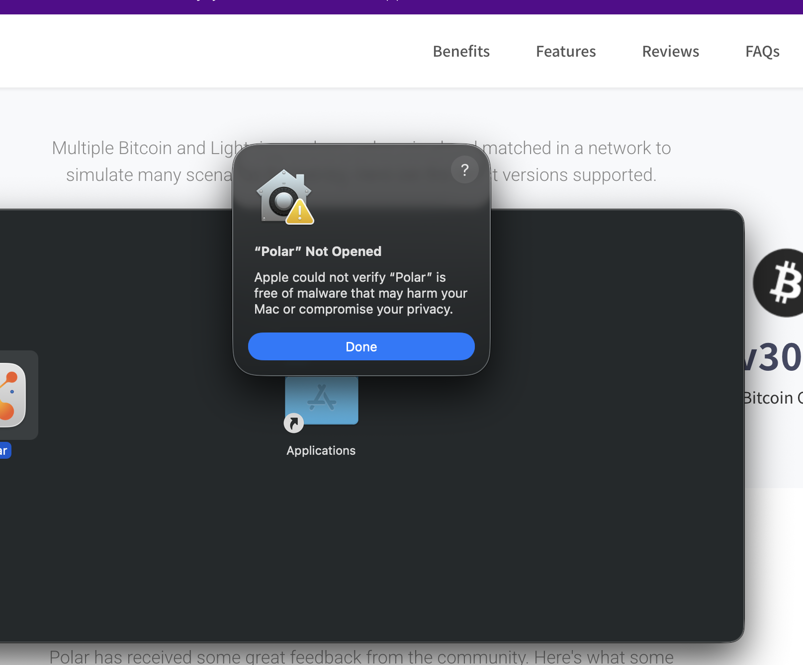
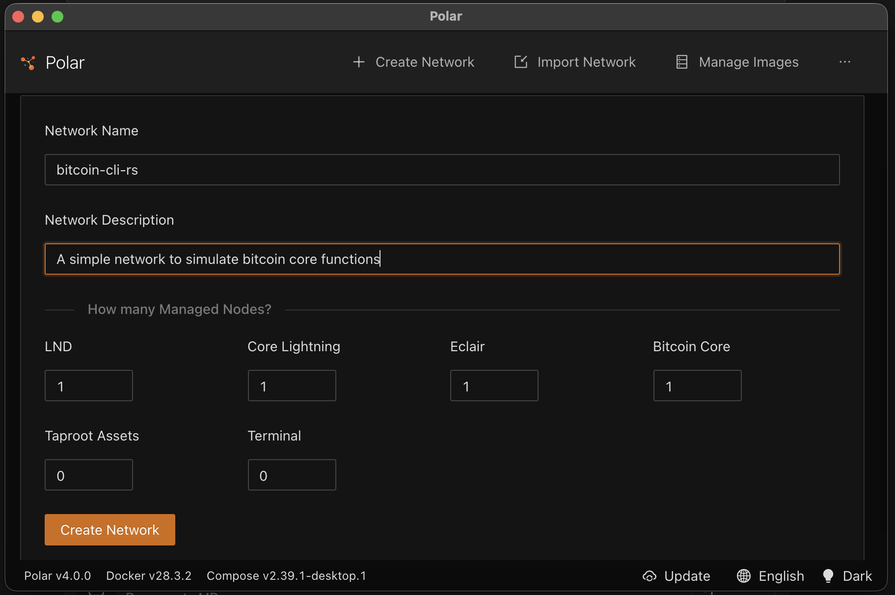
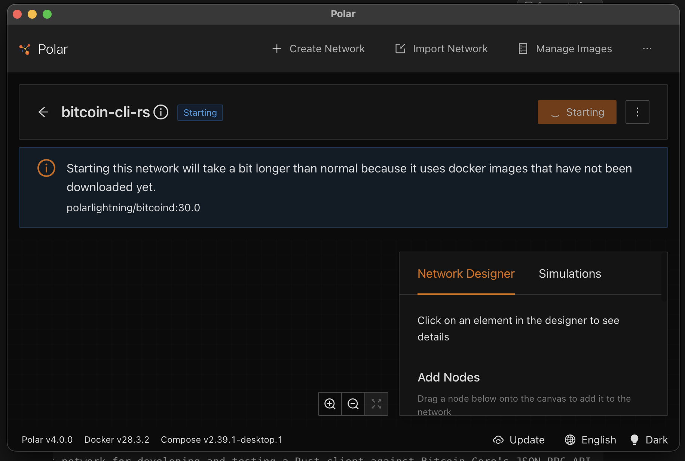
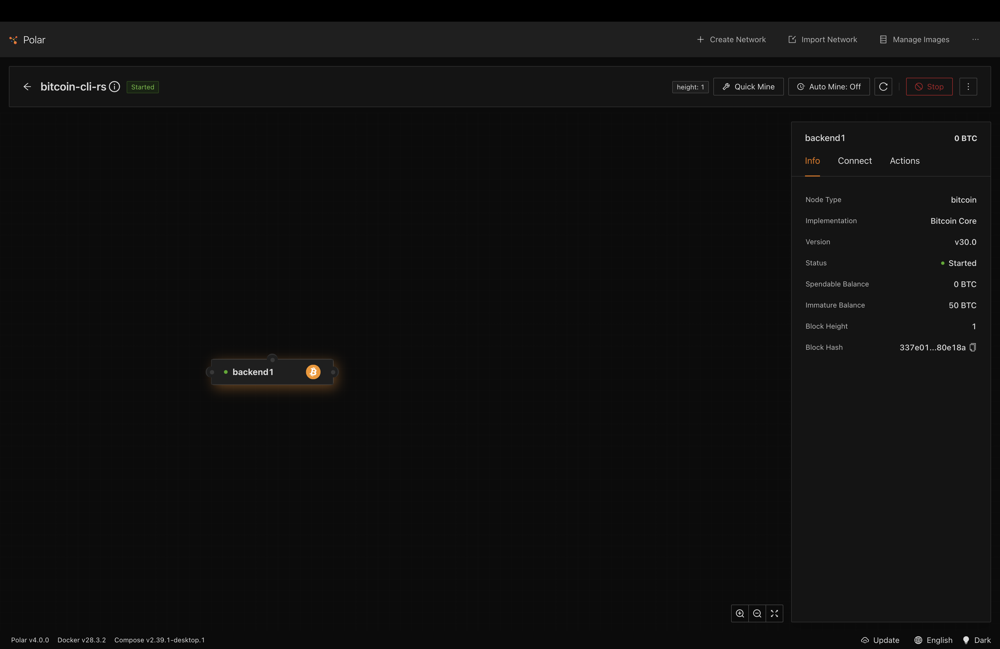
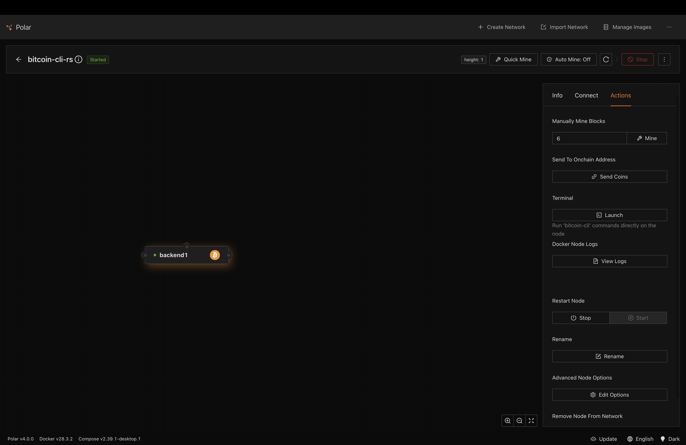

# Bitcoin-cli-rs

A modular Rust command-line client for interacting with Bitcoin Core through its JSON-RPC API.

> **Status:** All required blockchain, wallet, address, and generic JSON-RPC commands are implemented and verified against a Bitcoin Core Regtest node managed by Polar.

## Overview

`bitcoin-cli-rs` connects to a local Bitcoin Core node running on Regtest through [Polar](https://lightningpolar.com/). It provides friendly commands for common blockchain and wallet operations while retaining access to arbitrary Bitcoin Core RPC methods.

The project is being built for the Rust for Bitcoin Program 2.0 technical assessment, but its structure and naming are intended to support continued development after the assessment.

## Commands

| Command | Purpose | Status |
| --- | --- | --- |
| `blockchain-info` | Display the chain, block and header counts, difficulty, and verification progress. | Implemented |
| `wallet-info` | Display the wallet name, trusted, unconfirmed, and immature balances, and transaction count. | Implemented |
| `balance` | Print the wallet's trusted balance. | Implemented |
| `new-address` | Generate and print a new Bech32 receiving address. | Implemented |
| `rpc <method> [params...]` | Execute an arbitrary Bitcoin Core JSON-RPC method with dynamically parsed parameters. | Implemented |

Current working examples:

```bash
cargo run -- blockchain-info
cargo run -- wallet-info
cargo run -- balance
cargo run -- new-address
cargo run -- rpc getblockcount
cargo run -- rpc getblockhash 200
cargo run -- rpc getblock 305f60a3fa9324e846bc26b87056b4b6c69dc72d8c222404a9421eda442631c8
```

Generic RPC parameters are positional. Each parameter is parsed as JSON when possible, so values such as `200`, `true`, `null`, `[1,2]`, and JSON objects retain their types. Bare hashes, addresses, and other non-JSON values are treated as strings.

## Architecture

This repository is a single Cargo package organized into focused Rust modules:

```text
bitcoin-cli-rs/
├── src/
│   ├── main.rs               # Executable entry point and logger setup
│   ├── cli.rs                # Clap arguments and subcommands
│   ├── rpc.rs                # JSON-RPC transport, methods, and models
│   ├── config.rs             # TOML, environment, and CLI configuration
│   ├── error.rs              # Typed RPC errors
│   ├── logger.rs             # Structured tracing setup
│   └── commands/
│       ├── mod.rs            # Command dispatch and shared command helpers
│       ├── blockchain.rs     # Blockchain command output
│       ├── wallet.rs         # Wallet information and balance output
│       ├── address.rs        # New-address output
│       └── rpc.rs            # Generic RPC execution and parameter parsing
├── Cargo.toml                # Package metadata and dependencies
├── config.example.toml       # TOML configuration template
└── .env.example              # Environment-variable template
```

The intended request flow is:

```text
Terminal command
    -> bitcoin-cli-rs
    -> rpc module
    -> Bitcoin Core JSON-RPC
    -> Polar Regtest node
```

## Installation

Install the following prerequisites:

- Rust 1.85 or newer and Cargo, preferably through [rustup](https://rustup.rs/).
- [Docker Desktop](https://www.docker.com/products/docker-desktop/).
- [Polar](https://lightningpolar.com/).

Clone and build the application:

```bash
git clone https://github.com/Kingscliq/bitcoin-cli-rs.git
cd bitcoin-cli-rs
cargo build
```

## Polar and Bitcoin Core setup

Polar runs Bitcoin Core in an isolated Docker container and configures it for Regtest. A separate Bitcoin Core desktop installation is not required.

### 1. Install Polar on Apple Silicon macOS

1. Start Docker Desktop.
2. Download the ARM64 DMG from the official [Polar releases](https://github.com/jamaljsr/polar/releases) page. The ARM64 asset is the appropriate build for Apple Silicon Macs.
3. Drag `Polar.app` into `/Applications` and open it.

macOS may initially block Polar with a Gatekeeper message:



First try **System Settings -> Privacy & Security -> Open Anyway**. If the option is unavailable, the following commands allowed the trusted GitHub-release build to open in the tested environment:

```bash
xattr -cr /Applications/Polar.app
open /Applications/Polar.app
```

`xattr -cr` removes extended attributes, including the quarantine attribute. Only use it for an application downloaded from a source you trust; do not use it as a general Gatekeeper bypass.

### 2. Create the Regtest network

In Polar:

1. Select **Create Network**.
2. Name the network `bitcoin-cli-rs`.
3. Set **Bitcoin Core** to `1`.
4. Set LND, Core Lightning, Eclair, Taproot Assets, and Terminal to `0`; they are not required by this assessment.
5. Select **Create Network**.



### 3. Start the network

Start the network and wait while Docker downloads `polarlightning/bitcoind` on the first run:



The network is ready when Polar displays **Started** and the Bitcoin Core node has a green status indicator:



### 4. Obtain the RPC connection details

Select the Bitcoin Core node, then open its **Connect** tab. Copy these values into the application configuration:

- **RPC Host** -> `rpc_url` or `BITCOIN_RPC_URL`
- **Username** -> `BITCOIN_RPC_USER`
- **Password** -> `BITCOIN_RPC_PASSWORD`

The first Polar node commonly exposes RPC on `http://127.0.0.1:18443`, but use the value displayed by your own network. Do not publish screenshots containing the username or password.

### 5. Create the Regtest wallet

A new Bitcoin Core node provides wallet functionality but does not automatically create a wallet. Open the node's **Actions** tab and select **Launch** under Terminal:



Create and verify the wallet:

```bash
bitcoin-cli createwallet "bitcoin-cli-rs-wallet"
bitcoin-cli -rpcwallet=bitcoin-cli-rs-wallet getwalletinfo
```

Blockchain-only commands work without a wallet. `wallet-info`, `balance`, and `new-address` require the configured wallet to exist and be loaded.

### 6. Verify the node and application

Inside the Polar terminal:

```bash
bitcoin-cli getblockchaininfo
```

From the project directory in your normal terminal:

```bash
cargo run -- blockchain-info
cargo run -- wallet-info
```

## Configuration

The application supports a local TOML file with environment-variable overrides.

Copy the provided templates:

```bash
cp config.example.toml config.toml
cp .env.example .env
```

Example non-sensitive TOML configuration:

```toml
rpc_url = "http://127.0.0.1:18443"
wallet = "bitcoin-cli-rs-wallet"
timeout_seconds = 30
```

Example environment variables:

```env
BITCOIN_RPC_USER=your_rpc_username
BITCOIN_RPC_PASSWORD=your_rpc_password
```

The intended precedence is:

```text
CLI flags -> environment variables -> config.toml -> built-in defaults
```

Obtain the RPC URL, username, and password from the connection details for the Bitcoin Core node inside Polar. Never commit real RPC credentials. Both `.env` and `config.toml` are ignored by Git.

The application validates that credentials are present, the timeout is greater than zero, and the RPC URL uses HTTP or HTTPS before attempting a request. Passwords are not included in command output or debug representations.

## Logging

The executable initializes `tracing-subscriber` once from `main.rs`. Application and RPC modules emit structured events using `tracing`. Logs are written to stderr so stdout remains suitable for command results and shell scripts.

Logging defaults to `warn`. Set `RUST_LOG` to increase verbosity:

```bash
RUST_LOG=bitcoin_cli_rs=info cargo run -- wallet-info
RUST_LOG=bitcoin_cli_rs=debug cargo run -- blockchain-info
```

RPC credentials and RPC parameter values are never logged.

`main.rs` is the only executable entry point. Every other file under `src/` is a Rust module compiled into the same executable.

## Build the application

From the repository root:

```bash
cargo build
```

Check the package:

```bash
cargo check
```

Root-level `cargo run -- ...` commands target the `bitcoin-cli-rs` executable.

## Development checks

Before submitting changes, run:

```bash
cargo fmt --check
cargo clippy --all-targets --all-features -- -D warnings
cargo test
cargo build
```

## Example output

With the Polar Regtest network running:

```text
$ cargo run -- blockchain-info
Chain:                 regtest
Blocks:                201
Headers:               201
Best block hash:       79030f99133d9e69237099a189fcb7aa26e02077d51b89268f314d326e5610ac
Difficulty:            0.00000000046565423739069247
Verification progress: 100.00%
Initial block download: false
Pruned:                false
```

Block height and hashes will differ as blocks are generated in each user's Regtest network.

Wallet command examples:

```text
$ cargo run -- wallet-info
Wallet:              bitcoin-cli-rs-wallet
Trusted balance:     5000.0 BTC
Unconfirmed balance: 0.0 BTC
Immature balance:    3700.0 BTC
Transactions:        200

$ cargo run -- balance
5000.0 BTC

$ cargo run -- new-address
bcrt1qja0mtkccr8ynwdrkwxk7gpzgljrgmxwyy6a73w
```

Wallet balances and newly generated Regtest addresses will differ between environments. Regtest addresses and coins have no mainnet value.

Generic RPC examples:

```text
$ cargo run -- rpc getblockcount
201

$ cargo run -- rpc getblockhash 200
"305f60a3fa9324e846bc26b87056b4b6c69dc72d8c222404a9421eda442631c8"

$ cargo run -- rpc getblock 305f60a3fa9324e846bc26b87056b4b6c69dc72d8c222404a9421eda442631c8
{
  "confirmations": 2,
  "hash": "305f60a3fa9324e846bc26b87056b4b6c69dc72d8c222404a9421eda442631c8",
  "height": 200,
  "nTx": 1,
  "nextblockhash": "79030f99133d9e69237099a189fcb7aa26e02077d51b89268f314d326e5610ac",
  "size": 250,
  "versionHex": "30000000",
  "weight": 892
}
```

The `getblock` example above is shortened to its most relevant fields for readability. The CLI prints the complete JSON object returned by Bitcoin Core.

## Error-handling approach

- The RPC module exposes structured errors using `thiserror`.
- The CLI command layer adds user-facing context using `anyhow`.
- Connection failures, authentication failures, invalid methods or parameters, and missing wallets produce clear messages without panicking.
- If the configured wallet does not exist or is not loaded, wallet commands will identify the wallet by name and explain how to create or load it. They will exit with a non-zero status instead of panicking.

## Security

- Do not commit `.env` or `config.toml`.
- Do not include Polar RPC credentials in screenshots or example output.
- Commit only `.env.example` and `config.example.toml`, using placeholder values.

## Implementation roadmap

- [x] Create the Cargo package and module structure.
- [x] Separate CLI, RPC, configuration, errors, and command concerns.
- [x] Add safe configuration templates.
- [x] Implement configuration loading and precedence.
- [x] Implement the reusable JSON-RPC client.
- [x] Implement and verify `blockchain-info` against Polar.
- [x] Implement and verify the wallet-related named commands.
- [x] Implement dynamic generic RPC parameters.
- [x] Add focused unit tests.
- [ ] Add automated integration tests.
- [x] Verify all required commands against a Polar Regtest node.
- [x] Add real, safely redacted terminal output for every required command.

## Assumptions

- Bitcoin Core is accessed locally through Polar and runs in Regtest mode.
- Wallet commands require a wallet that exists and is loaded.
- The `balance` command reports the wallet's trusted balance.
- Generic RPC arguments will be parsed as JSON values when possible and otherwise treated as strings.
